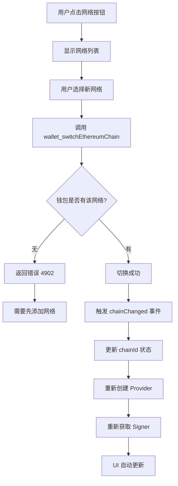

# 🔄 切换链功能详解

## 📋 目录
1. [切换链后的变化](#切换链后的变化)
2. [技术实现原理](#技术实现原理)
3. [实际影响范围](#实际影响范围)
4. [测试场景](#测试场景)
5. [注意事项](#注意事项)

---

## 🔀 切换链后的变化

### 1️⃣ **状态层面的变化**

当您点击网络按钮切换链时，以下状态会自动更新：

```typescript
// 状态更新流程
{
  chainId: '0x1' → '0x89',           // 链 ID 变化（ETH → Polygon）
  provider: BrowserProvider,          // Provider 会重新初始化
  signer: JsonRpcSigner,              // Signer 会重新获取
  address: '0x...'                    // 地址保持不变（同一钱包）
}
```

### 2️⃣ **UI 层面的变化**

| 元素 | 变化 |
|------|------|
| **网络按钮文字** | `Ethereum Mainnet` → `Polygon Mainnet` |
| **网络符号** | `ETH` → `MATIC` |
| **网络下拉菜单** | 当前选中项高亮切换 |
| **钱包地址** | 保持不变 |

### 3️⃣ **合约交互的变化**

**关键影响：合约地址在不同链上是不同的！**

```typescript
// 示例：USDC 合约地址
Ethereum:  0xA0b86991c6218b36c1d19D4a2e9Eb0cE3606eB48
Polygon:   0x2791Bca1f2de4661ED88A30C99A7a9449Aa84174
BSC:       0x8AC76a51cc950d9822D68b83fE1Ad97B32Cd580d
```

**如果您切换链后不更改合约地址，会发生什么？**

❌ **错误场景**：
```
1. 在 Ethereum 主网输入 USDC 地址
2. 切换到 Polygon 网络
3. 点击调用合约
4. ❌ 失败！因为 Polygon 上这个地址可能：
   - 不存在任何合约
   - 存在但不是 USDC 合约
   - 存在但 ABI 不匹配
```

---

## ⚙️ 技术实现原理

### 切换链的完整流程



### 代码实现

#### 1. **切换网络函数**
```typescript:store/walletStore.ts
switchNetwork: async (chainId: string) => {
  try {
    // 请求钱包切换链
    await window.ethereum.request({
      method: 'wallet_switchEthereumChain',
      params: [{ chainId }],  // 例如: '0x89' (Polygon)
    });

    // 更新状态
    set({ chainId });

  } catch (error: any) {
    // 如果网络不存在（错误代码 4902）
    if (error.code === 4902) {
      console.log('网络不存在，需要添加网络');
      // 可以在这里调用 wallet_addEthereumChain
    }
    throw error;
  }
}
```

#### 2. **监听链变化**
```typescript:store/walletStore.ts
// 在 connect() 函数中注册监听器
window.ethereum.on('chainChanged', (chainId: string) => {
  set({ chainId });
  
  // 🔄 重要：重新创建 Provider 和 Signer
  if (window.ethereum) {
    const newProvider = new BrowserProvider(window.ethereum);
    newProvider.getSigner().then((signer) => {
      set({ provider: newProvider, signer });
    });
  }
});
```

---

## 🎯 实际影响范围

### ✅ **会自动更新的部分**

1. **网络显示**
   - 头部网络按钮文字
   - 网络下拉菜单选中状态
   
2. **Provider 和 Signer**
   - 自动重新初始化
   - 指向新链的 RPC 节点

3. **Gas 费用**
   - 不同链的 Gas 价格不同
   - ETH: ~20-50 Gwei
   - Polygon: ~30-100 Gwei
   - BSC: ~3-5 Gwei

### ❌ **不会自动更新的部分**

1. **合约地址输入框**
   - ⚠️ 需要用户手动更改
   - 不同链上同一合约地址不同

2. **ABI JSON**
   - 通常保持不变（相同合约）
   - 但如果是不同版本的合约，可能需要更新

3. **已填写的函数参数**
   - 保留在输入框中
   - 可能需要根据新链调整

---

## 🧪 测试场景

### 场景 1：查询 ERC20 余额（跨链）

**步骤**：
```bash
1. 连接钱包（默认 Ethereum 主网）
2. 输入 USDC 合约地址（Ethereum）
   地址: 0xA0b86991c6218b36c1d19D4a2e9Eb0cE3606eB48
3. 加载 ERC20 ABI
4. 调用 balanceOf(你的地址)
   ✅ 返回：1000000000 (1000 USDC)

5. 切换到 Polygon 网络
6. ❌ 不更改合约地址，再次调用 balanceOf
   结果：失败或返回 0（该地址在 Polygon 上不是 USDC）

7. ✅ 更改为 Polygon USDC 地址
   地址: 0x2791Bca1f2de4661ED88A30C99A7a9449Aa84174
8. 再次调用 balanceOf
   ✅ 返回：500000000 (500 USDC on Polygon)
```

### 场景 2：发送交易（跨链）

**步骤**：
```bash
1. 在 Ethereum 主网调用 transfer 函数
   - Gas 费用：~$5-10 USD
   - 确认时间：~15 秒

2. 切换到 Polygon 网络
3. 更改合约地址为 Polygon USDC
4. 调用 transfer 函数
   - Gas 费用：~$0.01-0.05 USD
   - 确认时间：~2 秒

5. 切换到 BSC 网络
6. 更改合约地址为 BSC USDC
7. 调用 transfer 函数
   - Gas 费用：~$0.1-0.3 USD
   - 确认时间：~3 秒
```

---

## ⚠️ 注意事项

### 1. **合约地址必须手动更改**

```typescript
// ❌ 错误做法
切换链 → 直接调用合约 → 失败

// ✅ 正确做法
切换链 → 更新合约地址 → 调用合约 → 成功
```

### 2. **Gas 费用差异**

| 链 | 原生代币 | Gas 价格 | 转账成本 |
|---|---------|---------|---------|
| Ethereum | ETH | 20-50 Gwei | $5-10 |
| Polygon | MATIC | 30-100 Gwei | $0.01-0.05 |
| BSC | BNB | 3-5 Gwei | $0.1-0.3 |
| Sepolia (测试网) | SepoliaETH | 1-5 Gwei | 免费 |

### 3. **区块浏览器链接**

切换链后，交易哈希的浏览器链接也会改变：

```typescript
Ethereum:  https://etherscan.io/tx/0x...
Polygon:   https://polygonscan.com/tx/0x...
BSC:       https://bscscan.com/tx/0x...
Sepolia:   https://sepolia.etherscan.io/tx/0x...
```

### 4. **钱包余额**

切换链后，您的钱包余额会显示不同：

```typescript
// 同一个钱包地址 0xABC...
Ethereum:  10 ETH + 1000 USDC
Polygon:   5 MATIC + 500 USDC
BSC:       2 BNB + 200 USDC
```

### 5. **合约可能不存在**

```typescript
// 某些合约只部署在特定链上
Uniswap V3: ✅ Ethereum, ✅ Polygon, ❌ BSC
PancakeSwap: ❌ Ethereum, ❌ Polygon, ✅ BSC
```

---

## 🔧 未来改进建议

### 1. **自动提示合约地址不匹配**

```typescript
// 检测链切换
useEffect(() => {
  if (chainId && contractAddress) {
    // 检查合约是否存在
    provider.getCode(contractAddress).then((code) => {
      if (code === '0x') {
        alert('⚠️ 该地址在当前链上不存在合约，请更新合约地址');
      }
    });
  }
}, [chainId, contractAddress]);
```

### 2. **保存多链合约地址**

```typescript
// 用户可以为同一合约保存多个链的地址
const contractAddresses = {
  '0x1': '0xA0b86991c6218b36c1d19D4a2e9Eb0cE3606eB48',  // ETH USDC
  '0x89': '0x2791Bca1f2de4661ED88A30C99A7a9449Aa84174', // Polygon USDC
  '0x38': '0x8AC76a51cc950d9822D68b83fE1Ad97B32Cd580d', // BSC USDC
};

// 切换链时自动更新地址
useEffect(() => {
  if (chainId && contractAddresses[chainId]) {
    setContractAddress(contractAddresses[chainId]);
  }
}, [chainId]);
```

### 3. **显示当前链的区块浏览器**

```typescript
// 根据当前链显示对应的浏览器链接
const getExplorerUrl = (chainId: string, txHash: string) => {
  const explorers = {
    '0x1': `https://etherscan.io/tx/${txHash}`,
    '0x89': `https://polygonscan.com/tx/${txHash}`,
    '0x38': `https://bscscan.com/tx/${txHash}`,
    '0xaa36a7': `https://sepolia.etherscan.io/tx/${txHash}`,
  };
  return explorers[chainId] || '#';
};
```

---

## 📊 总结

### 切换链后会变化的：
✅ `chainId` 状态  
✅ `provider` 实例  
✅ `signer` 实例  
✅ UI 显示的网络名称  
✅ Gas 费用和确认时间  
✅ 钱包余额显示  

### 切换链后不会变化的：
❌ 合约地址输入框  
❌ ABI JSON 内容  
❌ 已填写的函数参数  
❌ 钱包地址（address）  

### 关键要点：
⚠️ **切换链后必须手动更新合约地址**，否则调用会失败！

---

## 🎓 实践建议

1. **使用测试网测试**
   - 先在 Sepolia 测试网测试切换功能
   - 避免在主网浪费 Gas 费

2. **准备好各链的合约地址**
   - 提前查好目标合约在各链的地址
   - 使用区块浏览器验证合约存在

3. **注意 Gas 费用**
   - Ethereum 主网 Gas 费较高
   - 优先使用 Polygon 或 BSC 进行测试

4. **检查钱包余额**
   - 确保目标链上有足够的原生代币支付 Gas
   - ETH、MATIC、BNB 等

---

**文档版本**: v1.0  
**最后更新**: 2025-10-15  
**作者**: ABI Contract Tool Team

