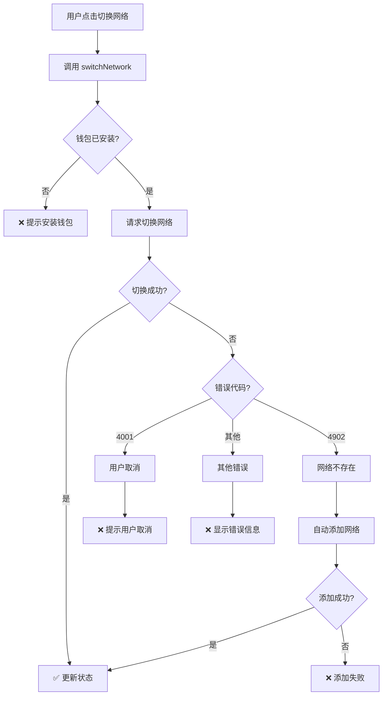

# 🚨 网络切换错误处理指南

## 错误：The Provider is not connected to the requested chain

### 📋 错误原因分析

这个错误通常由以下几种情况引起：

---

## 1️⃣ **钱包中没有添加该网络**（最常见）

### 问题描述
```
错误代码: 4902
错误信息: Unrecognized chain ID. Try adding the chain using wallet_addEthereumChain first.
```

### 原因
- 您的钱包（MetaMask/OKX 等）中没有配置该网络
- 例如：尝试切换到 Polygon，但钱包中从未添加过 Polygon 网络

### 解决方案
**✅ 已自动修复！**

现在代码会自动检测并添加网络：

```typescript
// 自动添加网络流程
try {
  // 1. 尝试切换网络
  await window.ethereum.request({
    method: 'wallet_switchEthereumChain',
    params: [{ chainId: '0x89' }],  // Polygon
  });
} catch (error) {
  // 2. 如果网络不存在（错误代码 4902）
  if (error.code === 4902) {
    // 3. 自动添加网络
    await window.ethereum.request({
      method: 'wallet_addEthereumChain',
      params: [{
        chainId: '0x89',
        chainName: 'Polygon Mainnet',
        nativeCurrency: {
          name: 'MATIC',
          symbol: 'MATIC',
          decimals: 18
        },
        rpcUrls: ['https://polygon-rpc.com'],
        blockExplorerUrls: ['https://polygonscan.com']
      }]
    });
  }
}
```

### 用户体验
```
1. 用户点击切换到 Polygon
2. 钱包弹窗：「是否添加 Polygon 网络？」
3. 用户点击「批准」
4. 网络自动添加并切换成功 ✅
```

---

## 2️⃣ **网络 RPC 节点不可用**

### 问题描述
```
错误信息: The Provider is not connected to the requested chain
原因: RPC 节点无法连接或响应超时
```

### 常见场景
- RPC 节点宕机或维护
- 网络连接问题
- 防火墙/代理阻止连接

### 解决方案

#### 方案 A: 更换 RPC 节点
```typescript
// types/index.ts - 配置多个备用 RPC
export const SUPPORTED_NETWORKS = {
  '0x89': {
    chainId: '0x89',
    chainName: 'Polygon Mainnet',
    rpcUrls: [
      'https://polygon-rpc.com',           // 主节点
      'https://rpc-mainnet.matic.network', // 备用节点 1
      'https://matic-mainnet.chainstacklabs.com', // 备用节点 2
    ],
    // ...
  }
};
```

#### 方案 B: 手动添加自定义 RPC
```bash
1. 打开 MetaMask
2. 点击网络下拉菜单
3. 点击「添加网络」
4. 选择「手动添加网络」
5. 输入自定义 RPC URL
```

推荐的 RPC 节点：

| 链 | 推荐 RPC | 备用 RPC |
|---|---------|---------|
| **Ethereum** | https://eth.llamarpc.com | https://rpc.ankr.com/eth |
| **Polygon** | https://polygon-rpc.com | https://rpc-mainnet.matic.network |
| **BSC** | https://bsc-dataseed.binance.org | https://bsc-dataseed1.defibit.io |
| **Sepolia** | https://rpc.sepolia.org | https://sepolia.infura.io/v3/YOUR_KEY |

---

## 3️⃣ **钱包状态不同步**

### 问题描述
```
症状: 切换网络后，UI 显示正确但调用失败
原因: Provider 和 Signer 没有及时更新
```

### 解决方案
**✅ 已自动修复！**

代码中已添加状态同步机制：

```typescript
// 切换网络后自动同步状态
await window.ethereum.request({
  method: 'wallet_switchEthereumChain',
  params: [{ chainId }],
});

// 等待 100ms 确保钱包状态更新
await new Promise(resolve => setTimeout(resolve, 100));

// 重新获取当前链 ID
const currentChainId = await window.ethereum.request({
  method: 'eth_chainId',
});

// 更新状态
set({ chainId: currentChainId });
```

同时，`chainChanged` 事件监听器会自动重新创建 Provider 和 Signer：

```typescript
window.ethereum.on('chainChanged', (chainId: string) => {
  set({ chainId });
  
  // 重新创建 Provider 和 Signer
  const newProvider = new BrowserProvider(window.ethereum);
  newProvider.getSigner().then((signer) => {
    set({ provider: newProvider, signer });
  });
});
```

---

## 4️⃣ **用户取消切换**

### 问题描述
```
错误代码: 4001
错误信息: User rejected the request
```

### 原因
- 用户在钱包弹窗中点击了「取消」或「拒绝」

### 解决方案
**✅ 已优化错误提示！**

```typescript
if (error.code === 4001) {
  throw new Error('用户取消了切换网络');
}
```

用户会看到友好的提示：
```
❌ 切换网络失败: 用户取消了切换网络
```

---

## 5️⃣ **不支持的网络**

### 问题描述
```
错误: 不支持的网络
原因: 尝试切换到未在 SUPPORTED_NETWORKS 中配置的网络
```

### 解决方案

#### 添加新网络到配置文件

```typescript:types/index.ts
export const SUPPORTED_NETWORKS: Record<string, Network> = {
  // 现有网络...
  
  // 添加新网络
  '0xa86a': {  // Avalanche C-Chain
    chainId: '0xa86a',
    chainName: 'Avalanche C-Chain',
    nativeCurrency: {
      name: 'Avalanche',
      symbol: 'AVAX',
      decimals: 18
    },
    rpcUrls: ['https://api.avax.network/ext/bc/C/rpc'],
    blockExplorerUrls: ['https://snowtrace.io']
  },
};
```

---

## 🔧 完整错误处理流程



---

## 📊 错误代码对照表

| 错误代码 | 含义 | 解决方案 |
|---------|------|---------|
| **4001** | 用户拒绝请求 | 提示用户重新尝试 |
| **4100** | 未授权的方法 | 检查钱包权限 |
| **4200** | 不支持的方法 | 更新钱包版本 |
| **4900** | 钱包未连接 | 先连接钱包 |
| **4901** | 链未连接 | 检查网络配置 |
| **4902** | 链不存在 | 自动添加网络 ✅ |
| **-32002** | 请求待处理 | 等待用户操作 |
| **-32603** | 内部错误 | 检查 RPC 节点 |

---

## 🧪 测试步骤

### 测试场景 1: 切换到已存在的网络

```bash
1. 连接钱包（默认 Ethereum）
2. 点击网络按钮
3. 选择「Sepolia Testnet」
4. ✅ 应该直接切换成功
```

### 测试场景 2: 切换到不存在的网络

```bash
1. 确保钱包中没有 Polygon 网络
2. 点击网络按钮
3. 选择「Polygon Mainnet」
4. 钱包弹窗：「是否添加 Polygon 网络？」
5. 点击「批准」
6. ✅ 网络添加并切换成功
```

### 测试场景 3: 用户取消切换

```bash
1. 点击网络按钮
2. 选择任意网络
3. 在钱包弹窗中点击「取消」
4. ✅ 显示：「用户取消了切换网络」
```

---

## 🛠️ 调试技巧

### 1. 查看当前链 ID

```typescript
// 在浏览器控制台执行
const chainId = await window.ethereum.request({ 
  method: 'eth_chainId' 
});
console.log('当前链 ID:', chainId);
```

### 2. 查看钱包中的所有网络

```bash
打开 MetaMask → 设置 → 网络 → 查看所有网络
```

### 3. 清除钱包缓存

```bash
MetaMask → 设置 → 高级 → 重置账户
⚠️ 注意：这会清除交易历史，但不会删除资产
```

### 4. 测试 RPC 连接

```bash
# 使用 curl 测试 RPC 节点
curl -X POST https://polygon-rpc.com \
  -H "Content-Type: application/json" \
  -d '{"jsonrpc":"2.0","method":"eth_chainId","params":[],"id":1}'

# 正常响应：
{"jsonrpc":"2.0","id":1,"result":"0x89"}
```

---

## 💡 最佳实践

### 1. 提供清晰的错误提示

```typescript
// ❌ 不好的错误提示
alert('Error');

// ✅ 好的错误提示
alert('切换网络失败: 钱包中不存在该网络，请先添加');
```

### 2. 自动重试机制

```typescript
async function switchNetworkWithRetry(chainId: string, maxRetries = 3) {
  for (let i = 0; i < maxRetries; i++) {
    try {
      await switchNetwork(chainId);
      return; // 成功
    } catch (error) {
      if (i === maxRetries - 1) throw error; // 最后一次失败
      await new Promise(r => setTimeout(r, 1000)); // 等待 1 秒重试
    }
  }
}
```

### 3. 添加加载状态

```typescript
const [switching, setSwitching] = useState(false);

const handleSwitch = async (chainId: string) => {
  setSwitching(true);
  try {
    await switchNetwork(chainId);
  } finally {
    setSwitching(false);
  }
};
```

---

## 📞 常见问题 FAQ

### Q1: 为什么切换网络这么慢？
**A**: 可能是 RPC 节点响应慢，建议更换 RPC 或等待。

### Q2: 切换网络后合约调用失败？
**A**: 需要更新合约地址！不同链上合约地址不同。

### Q3: 如何添加自定义网络？
**A**: 在 `types/index.ts` 的 `SUPPORTED_NETWORKS` 中添加配置。

### Q4: 支持哪些钱包？
**A**: 所有支持 EIP-1193 的钱包（MetaMask、OKX、Trust Wallet 等）。

### Q5: 测试网和主网可以互相切换吗？
**A**: 可以！但要注意测试网代币没有价值。

---

## 🎯 总结

### 现在的改进：

✅ **自动添加网络** - 检测到网络不存在时自动添加  
✅ **状态同步** - 切换后自动更新 Provider 和 Signer  
✅ **友好错误提示** - 清晰的错误信息  
✅ **多重错误处理** - 覆盖所有常见错误场景  

### 用户体验：

```
之前:
❌ 切换网络失败: The Provider is not connected to the requested chain

现在:
1. 自动检测网络是否存在
2. 如果不存在，弹窗询问是否添加
3. 用户批准后自动添加并切换
4. ✅ 切换成功！
```

---

**文档版本**: v1.0  
**最后更新**: 2025-10-15  
**作者**: ABI Contract Tool Team

